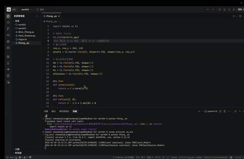
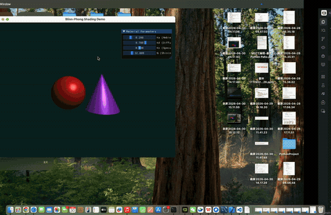
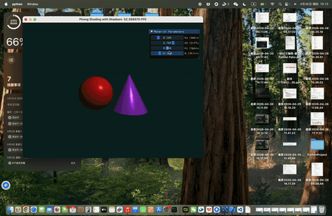

# Phong/Blinn-Phong 光照模型与硬阴影实现

这个项目基于Taichi图形库实现了经典的 Phong光照模型、优化版的Blinn-Phong光照模型，以及光线追踪方式的硬阴影效果，包含球体和圆锥两种几何形体的渲染与阴影检测。

## 📋 项目简介
本项目通过光线追踪技术，在 GPU 上并行渲染 3D 场景：
- 渲染红色球体和紫色圆锥两种几何体
- 实现基础 Phong 光照（环境光 + 漫反射 + 镜面高光）
- 实现优化版 Blinn-Phong 光照（更自然的镜面高光）
- 实现硬阴影效果（检测物体是否被其他几何体遮挡）
- 提供交互式面板，可实时调整光照参数

## 🎯 核心功能
| 文件名称 | 核心功能 |
|---------|---------|
| `Phong_.py` | 基础 Phong 光照模型实现，无阴影 |
| `Blinn_Phong.py` | 优化版 Blinn-Phong 光照模型，无阴影 |
| `Hard_Shadow.py` | 在 Phong 基础上增加硬阴影检测 |

## 🛠️ 环境准备
### 1. 安装 Taichi
确保已安装 Python 3.7+，然后执行：
```bash
pip install taichi
```

### 2. 运行方式
直接运行对应 Python 文件即可：
```bash
python Phong_.py

python Blinn_Phong.py

python Hard_Shadow.py
```

## 🖥️ 交互说明
程序运行后会弹出 800×600 的渲染窗口，右侧有参数调节面板：
- **Ka (Ambient)**：环境光系数（0.0~1.0），控制物体基础亮度
- **Kd (Diffuse)**：漫反射系数（0.0~1.0），控制物体受光面的基础亮度
- **Ks (Specular)**：镜面高光系数（0.0~1.0），控制高光区域的亮度
- **N (Shininess)**：高光指数（1.0~128.0），数值越大高光区域越小、越锐利

调节滑块时，画面会实时更新，直观看到参数变化的效果。

## 🧠 核心原理讲解
### 1. 光线追踪基础
程序通过向场景发射大量光线（每个像素一条），判断光线是否与几何体相交：
- **光线起点 (ro)**：摄像机位置（固定在 (0,0,5)）
- **光线方向 (rd)**：从摄像机指向像素的方向
- **相交检测**：计算光线与球体/圆锥的交点，取最近的交点进行着色

### 2. 光照模型
#### 基础 Phong 模型（3 个分量叠加）
- **环境光 (Ambient)**：模拟环境的基础光照，公式：`Ka × 光源颜色 × 物体颜色`
- **漫反射 (Diffuse)**：模拟光线照射到粗糙表面的散射效果，公式：`Kd × max(0, 法向量·光线方向) × 光源颜色 × 物体颜色`
- **镜面高光 (Specular)**：模拟光线照射到光滑表面的反射高光，公式：`Ks × (反射光线·视线方向)^高光指数 × 光源颜色`

#### Blinn-Phong 模型（优化高光计算）
将镜面高光的计算从「反射光线与视线的夹角」改为「半程向量与法向量的夹角」：
- 半程向量 (H)：光线方向与视线方向的中间向量
- 高光公式：`Ks × max(0, 法向量·半程向量)^高光指数 × 光源颜色`
- 优势：计算更高效，高光效果更自然

### 3. 硬阴影实现
在 `Hard_Shadow.py` 中，阴影检测的核心逻辑：
1. 从物体表面的交点向光源发射一条检测光线
2. 检测这条光线是否会被其他几何体（球体/圆锥）遮挡
3. 如果遮挡且遮挡物在交点与光源之间 → 判定为阴影区域
4. 阴影区域仅显示环境光，非阴影区域显示完整的光照效果

## 📐 几何体实现
### 1. 球体相交检测
通过解二次方程判断光线与球体的交点，公式基于「点到球心的距离」推导，只取最近的有效交点（t>0）。

### 2. 圆锥相交检测
将光线转换到圆锥局部坐标系，解二次方程后，额外验证交点是否在圆锥的高度范围内（避免检测到圆锥外的交点），并计算圆锥表面的法向量。

## 🎨 效果对比

### 1. Phong 光照

镜面高光基于反射向量，高光区域稍显「生硬」。

---

### 2. Blinn_Phong 光照

使用半程向量计算，高光更柔和、过渡更自然。

---

### 3. 硬阴影效果

阴影区域仅保留环境光，边界清晰，遮挡关系直观明确。

## 💡 扩展建议
1. **增加更多几何体**：可以参考球体/圆锥的实现方式，添加立方体、圆柱等
2. **软阴影**：在阴影检测时发射多条随机光线，模拟阴影的渐变效果
3. **多光源**：添加多个光源，分别计算每个光源的光照贡献
4. **纹理贴图**：给几何体添加纹理，替换纯色的物体颜色
5. **材质系统**：为不同几何体设置不同的光照参数
