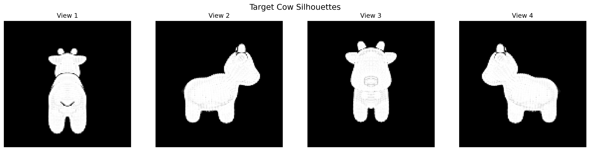
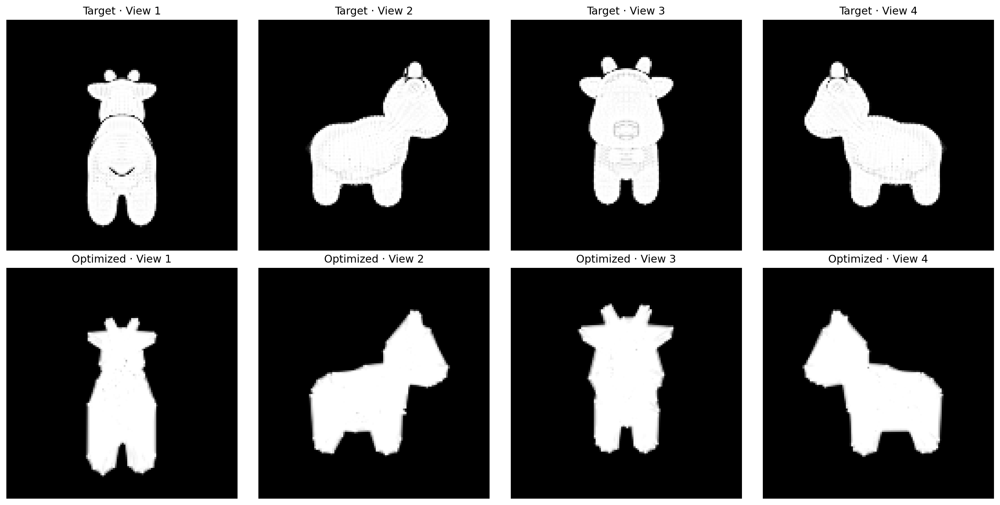
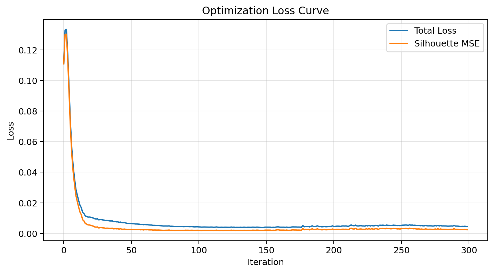

# 计算机图形学实验六：可微渲染

| 项目   | 信息                       |
| ---- | ------------------------ |
| 学号   | 202411081076             |
| 姓名   | 陈梦灵                      |
| 专业   | 计算机科学与技术                 |

## 一、实验内容

本实验使用 PyTorch3D 实现基于多视角轮廓约束的可微渲染优化。以 `cow.obj` 作为目标网格，在多个虚拟相机视角下渲染其目标剪影；再以高细分球体作为源网格，通过反向传播迭代优化源网格顶点偏移量，使其轮廓逐渐逼近目标奶牛模型。

## 二、实验目标

1. 理解软光栅化如何在轮廓边界保留可导梯度。
2. 掌握从多视角二维剪影反向优化三维网格顶点的方法。
3. 理解拉普拉斯平滑、边长约束和法线一致性正则化对保持网格质量的作用。

## 三、实现原理

传统硬光栅化中，像素是否属于三角形通常是离散判断，三角形边界附近的梯度容易消失。实验采用 PyTorch3D 的 `SoftSilhouetteShader` 进行软光栅化：像素覆盖关系在边界处以连续方式近似，从而可以将剪影误差反向传播到顶点坐标。

总损失由剪影误差和三类正则项构成：

\[
L_{\text{total}}=L_{\text{silhouette}}+
w_{\text{lap}}L_{\text{lap}}+
w_{\text{edge}}L_{\text{edge}}+
w_{\text{normal}}L_{\text{normal}}
\]

其中：

- `L_silhouette`：渲染剪影与目标剪影之间的均方误差（MSE）；
- `L_lap`：拉普拉斯平滑项，抑制局部尖刺和不连续形变；
- `L_edge`：边长正则项，减轻三角形过度拉伸或退化；
- `L_normal`：法线一致性项，使相邻三角面保持较平滑的法线变化。

## 四、运行环境

- Google Colab
- Python 3
- PyTorch
- PyTorch3D
- 建议使用 T4 GPU

## 五、运行方法

1. 将本目录中的 `fit_cow_silhouette_colab.ipynb` 上传至 Google Colab。
2. 在 Colab 中选择“运行时 → 更改运行时类型 → T4 GPU”。
3. 点击“全部运行”。
4. 当运行到上传模型单元时，选择本目录中的 `cow.obj`。
5. 程序将完成 300 次顶点优化，并自动下载 `work06_results.zip`。

## 六、核心实现流程

1. 读取并归一化目标奶牛网格。
2. 在 4 个环绕视角下渲染目标软剪影。
3. 创建细分球体作为源网格，并将顶点偏移量设为可学习参数。
4. 每轮迭代渲染当前源网格，计算剪影 MSE 与网格正则化损失。
5. 使用 Adam 优化器更新顶点偏移量，共优化 300 次。
6. 导出最终网格、剪影对比图、损失曲线和优化过程 GIF。

## 七、结果展示

### 1. 目标模型的多视角剪影



### 2. 优化后剪影与目标剪影对比



### 3. 总损失变化曲线



### 4. 优化过程


最终优化后的网格保存在 `results/final_mesh.obj`，最终损失和实验参数记录在 `results/metrics.txt`。

## 八、目录结构

```text
work06/
├── cow.obj                              # 目标奶牛模型
├── fit_cow_silhouette_colab.ipynb       # Colab 主程序
├── README.md                            # 实验说明
└── results/                             # 运行完成后放入输出结果
    ├── target_silhouettes.png
    ├── final_silhouette_comparison.png
    ├── loss_curve.png
    ├── optimization_progress.gif
    ├── final_mesh.obj
    └── metrics.txt
```

