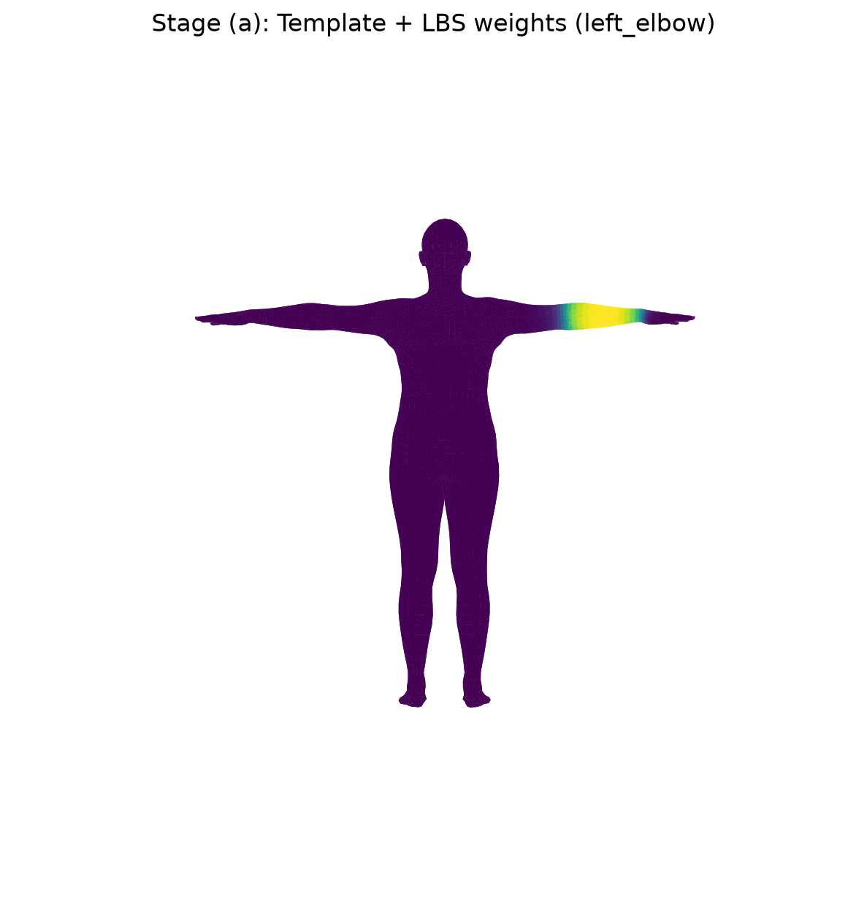
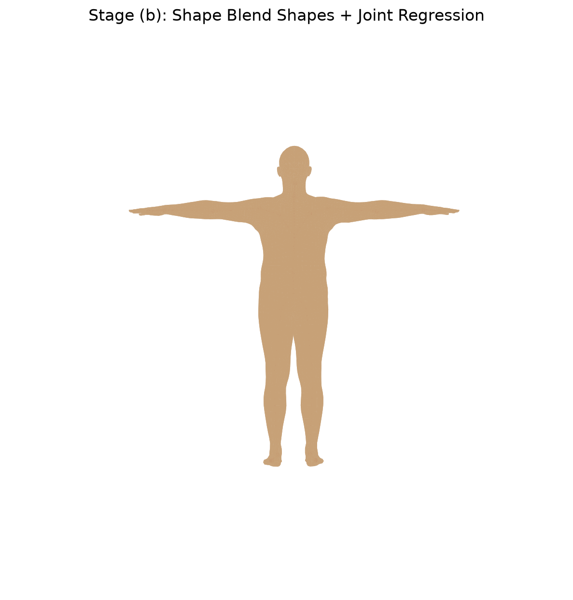
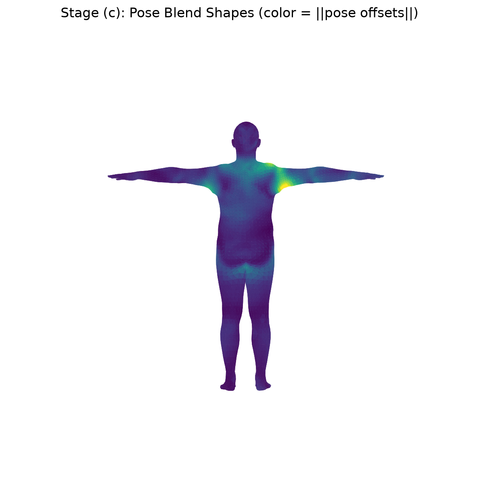
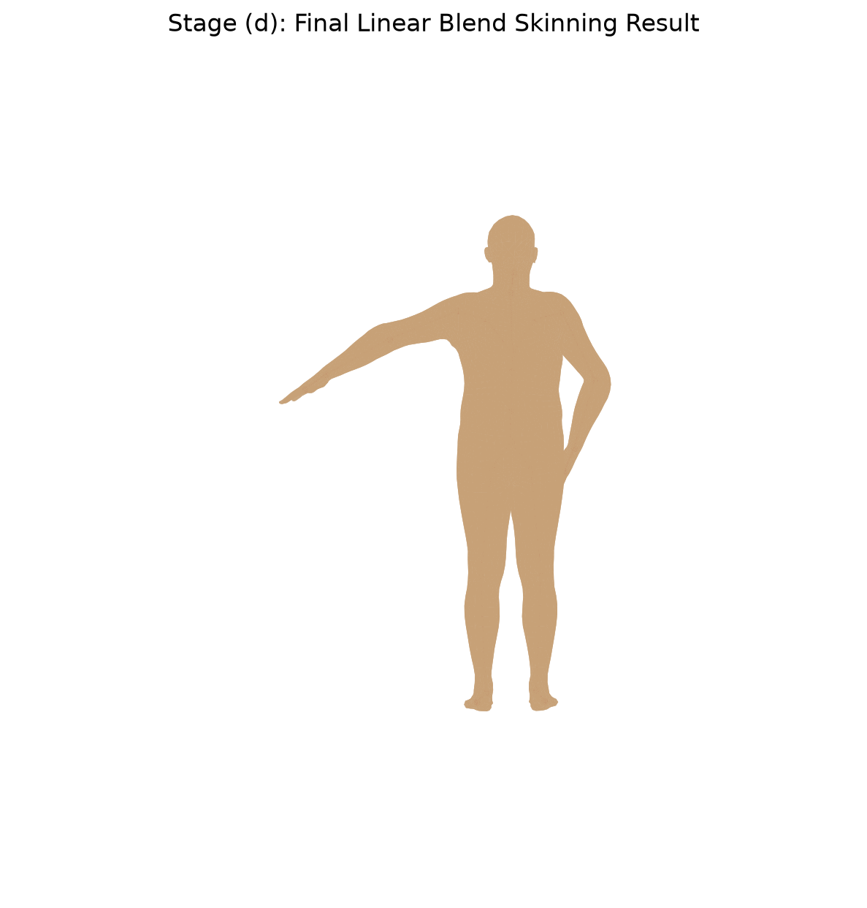
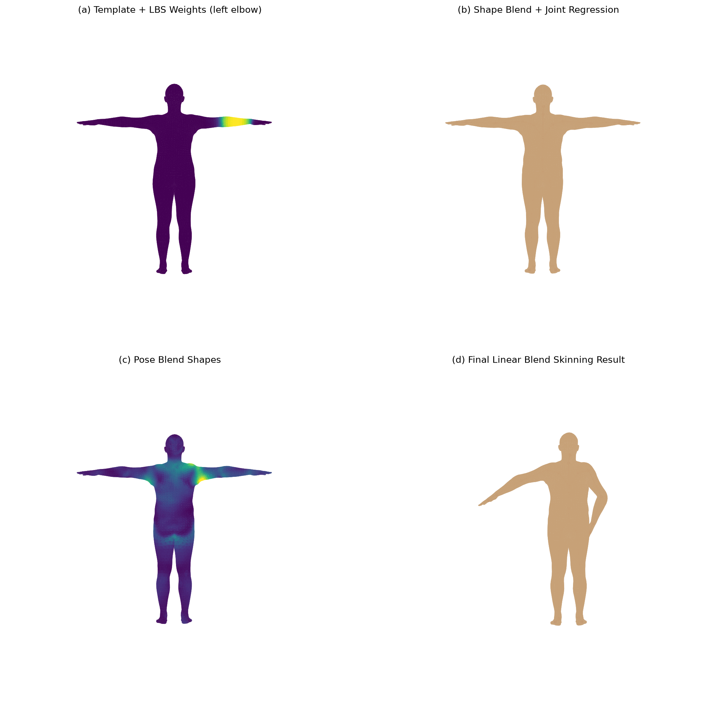
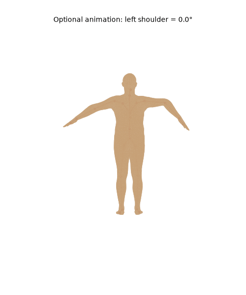

# work08：基于 SMPL 的 Linear Blend Skinning（LBS）可视化

## 1. 实验目标

本实验基于 SMPL 中性人体模型，拆解并可视化完整的 Linear Blend Skinning（LBS）过程：模板网格与蒙皮权重、形状混合与关节回归、姿态校正、前向运动学与最终蒙皮。程序还手写了 LBS 核心流程，并与 `smplx` 官方前向结果进行逐顶点误差验证。

实现的核心关系为：

- 模板阶段：`v_template` 与 `lbs_weights`
- 形状阶段：`v_shaped = v_template + B_S(β)`，再由 `J_regressor` 回归关节 `J`
- 姿态校正：`v_posed = v_shaped + B_P(θ)`
- 最终蒙皮：对每个顶点加权组合多个关节的刚体变换，得到 `verts`

## 2. 项目结构

```text
work08/
├── assets/
│   └── models/
│       └── SMPL_NEUTRAL.pkl        
├── outputs/                        # 运行 main.py 后自动生成
│   ├── stage_a_template_weights.png
│   ├── all_joint_weights.png
│   ├── stage_b_shaped_joints.png
│   ├── stage_c_pose_offsets.png
│   ├── stage_d_lbs_result.png
│   ├── comparison_grid.png
│   ├── optional_pose_animation.gif
│   └── summary.txt
├── main.py
├── requirements.txt
├── .gitignore
└── README.md
```

## 3. 环境配置与运行方法

推荐在 Python 3.10+ 环境中运行。进入 `work08` 文件夹后执行：

```bash
python3 -m venv .venv
source .venv/bin/activate
python -m pip install --upgrade pip
python -m pip install -r requirements.txt
```

将已下载的 `SMPL_NEUTRAL.pkl` 复制到：

```text
assets/models/SMPL_NEUTRAL.pkl
```

然后运行：

```bash
python main.py
```

若模型文件位于其他位置，可直接指定路径：

```bash
python main.py --model-path /你的路径/SMPL_NEUTRAL.pkl
```

默认使用 CPU，Mac 可在确认 MPS 可用时改为：

```bash
python main.py --device mps
```

程序默认同时生成必做内容和选做 GIF 动画。仅调试必做部分时可使用：

```bash
python main.py --skip-animation
```

## 4. 实现说明

### 4.1 模型加载与基础信息

程序使用：

```python
smplx.create(model_path, model_type="smpl", gender="neutral")
```

读取 SMPL 模型，并在控制台和 `outputs/summary.txt` 中记录：顶点数、面片数、运动学关节数、`betas` 维度、`lbs_weights`、`shapedirs`、`posedirs` 的形状。

### 4.2 阶段（a）：模板网格与蒙皮权重

程序选择第 18 号关节（`left_elbow`），将 `lbs_weights[:, 18]` 映射为顶点颜色。颜色越亮，表示该顶点越受左肘关节影响。

同时输出 `all_joint_weights.png`：色相表示主导影响关节，亮度表示该主导权重的大小，用于辅助观察人体不同区域的关节控制范围。



### 4.3 阶段（b）：形状校正与关节回归

设置前几个非零 `betas` 后，程序计算：

```python
v_shaped = v_template + blend_shapes(betas, shapedirs)
J = vertices2joints(J_regressor, v_shaped)
```

其中 `v_shaped` 是体型变化后的网格；`J` 不是固定坐标，而是由形状变化后的网格线性回归得到的关节位置。图中红色点和红色线分别为关节点和骨架连接关系。



### 4.4 阶段（c）：姿态相关校正

程序通过轴角参数构造旋转矩阵，并计算：

```python
pose_feature = R(theta) - I
pose_offsets = pose_feature @ posedirs
v_posed = v_shaped + pose_offsets
```

图中颜色表示每个顶点的 `||pose_offsets||`。弯曲较明显的肩、肘等区域通常会出现更大的姿态校正，用于避免只做刚体旋转造成的局部塌陷和不自然褶皱。



### 4.5 阶段（d）：手写 Linear Blend Skinning

本实验没有只调用官方 `lbs()`，而是在 `main.py` 中手写了以下步骤：

1. 由 `betas` 与 `shapedirs` 得到 `v_shaped`；
2. 用 `J_regressor` 从 `v_shaped` 回归关节 `J`；
3. 由姿态轴角参数得到 `rot_mats`、`pose_feature`、`pose_offsets` 和 `v_posed`；
4. 沿运动学树计算关节全局刚体变换 `A` 与变换后关节 `J_transformed`；
5. 对每个顶点按 `lbs_weights` 对所有关节变换加权，得到最终顶点 `verts`。

最终的 `verts` 已经同时包含体型、姿态校正和多关节平滑蒙皮效果。



## 5. 四阶段总对比图

程序输出 `comparison_grid.png`，将模板+权重、形状+关节、姿态校正、最终 LBS 结果排为 2×2 对比图。



## 6. 手写 LBS 与官方结果一致性验证

程序将同一组 `betas`、`global_orient` 与 `body_pose` 同时输入：

- 本实验手写的 `hand_written_lbs()`；
- `smplx` 官方模型前向过程。

随后逐顶点比较两份 `verts`，在 `outputs/summary.txt` 中输出以下误差：

- 平均绝对误差（Mean Absolute Error, MAE）；
- 最大绝对误差（Max Absolute Error, MaxAE）；
- 同时记录前 24 个运动学关节的位置误差。

理论上，两种实现遵循相同计算流程，结果应仅存在极小浮点误差。`MaxAE < 1e-5` 可视为手写实现与官方前向结果一致。

## 7. 选做：姿态动画

选做部分固定上述非零 `betas`，让左肩关节从 0 平滑旋转至目标角度。程序输出：

```text
outputs/optional_pose_animation.gif
```

该动画可以观察到：手臂及肩部附近顶点会随关节运动平滑带动，而不是在某个边界位置发生刚性断裂。



## 8. 思考题回答

### 任务 2：蒙皮权重

1. **为什么一个顶点不只受一个关节影响？**
   关节交界区域需要同时受相邻骨骼影响，才能保证皮肤连续地过渡。若每个顶点只选择一个关节，关节弯曲处会产生明显断裂。

2. **一个顶点的权重几乎全给某一个关节会怎样？**
   该顶点会近似刚性地跟随该关节运动。在骨骼中段这是合理的；若发生在关节附近，容易形成生硬折痕或网格撕裂感。

3. **权重分布很平均会怎样？**
   变形会较平滑，但会过度“软化”，出现体积损失或类似橡皮的拉伸效果，不能准确保留局部形状。

### 任务 3：形状校正与关节回归

1. **为什么关节要从形状后的网格回归？**
   人体高矮、胖瘦、肩宽、腿长改变时，关节相对位置也应随之改变。关节由 `v_shaped` 回归能使骨架和体型一致。

2. **人物变胖或变瘦时关节位置会变化吗？**
   会。关节的整体位置和局部位置会随着身高、肢体长度和躯干形状发生变化。

3. **`v_template` 与 `v_shaped` 的差别是什么？**
   `v_template` 是固定的标准模板网格；`v_shaped` 是模板叠加形状混合形变后的当前体型网格。

### 任务 4：姿态校正

1. **为什么 LBS 之前还要加 pose corrective？**
   仅靠刚体旋转和线性加权不能描述人体弯曲时的局部肌肉、皮肤和体积变化。姿态校正补偿这类非刚性几何变形。

2. **去掉 `pose_offsets` 后会怎样？**
   肩、肘、膝等弯曲区域更容易出现塌陷、拉伸或不自然褶皱，最终姿态会显得僵硬。

3. **`v_shaped` 与 `v_posed` 的本质区别是什么？**
   `v_shaped` 只体现体型差异；`v_posed` 在 `v_shaped` 基础上加入姿态相关的局部校正，但此时还没有完成最终骨架蒙皮。

### 任务 5：最终 LBS

1. **`J` 和 `J_transformed` 有什么区别？**
   `J` 是形状后的静止姿态关节位置；`J_transformed` 是经运动学树传播、应用当前姿态旋转后的全局关节位置。

2. **为什么顶点要对多个关节变换加权，而不是只选最大权重关节？**
   对多个关节加权可以使交界区域连续过渡，避免硬切换导致的裂缝和明显折痕。这正是 Linear Blend Skinning 中“Blend”的含义。

